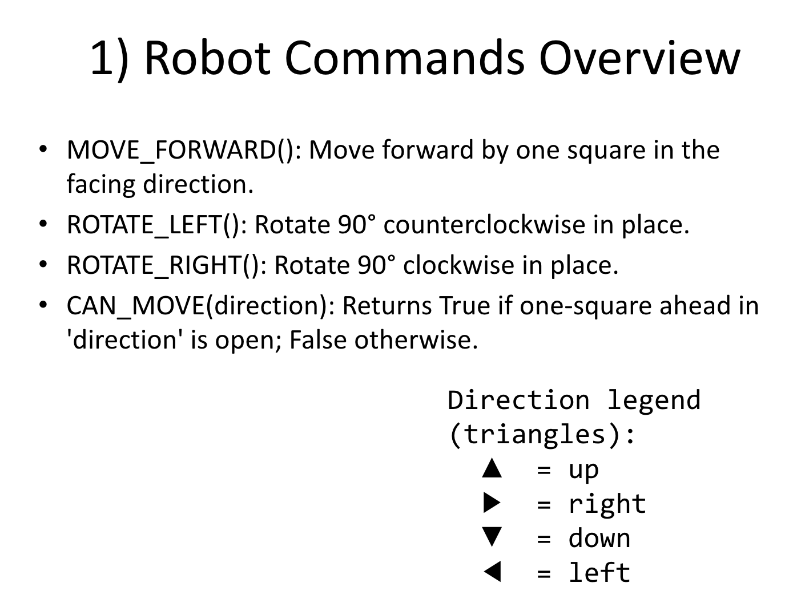
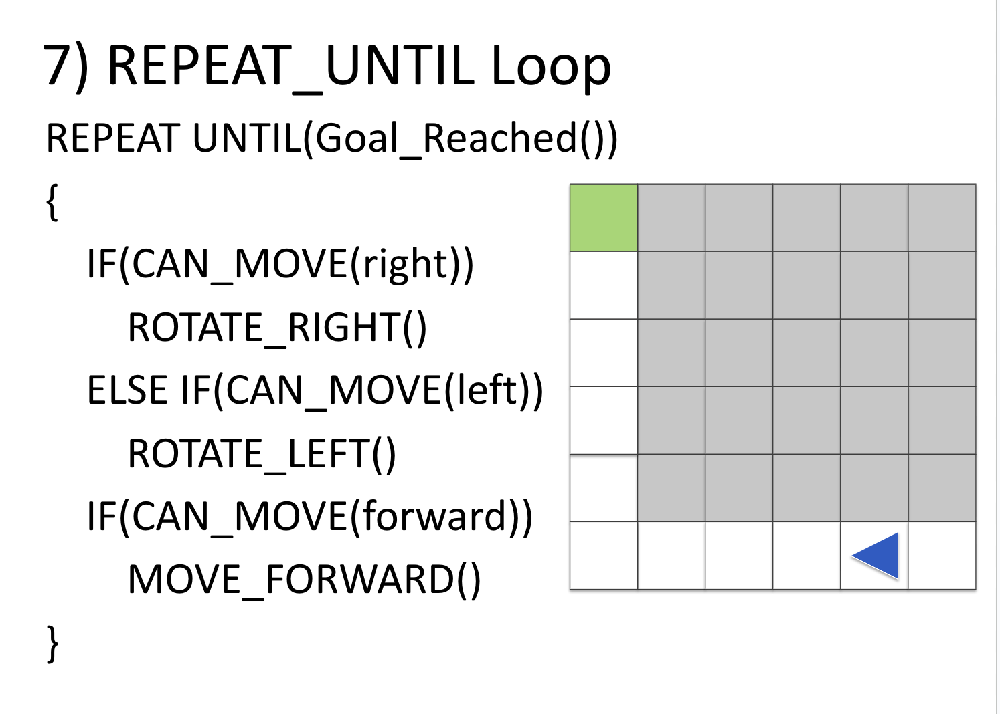
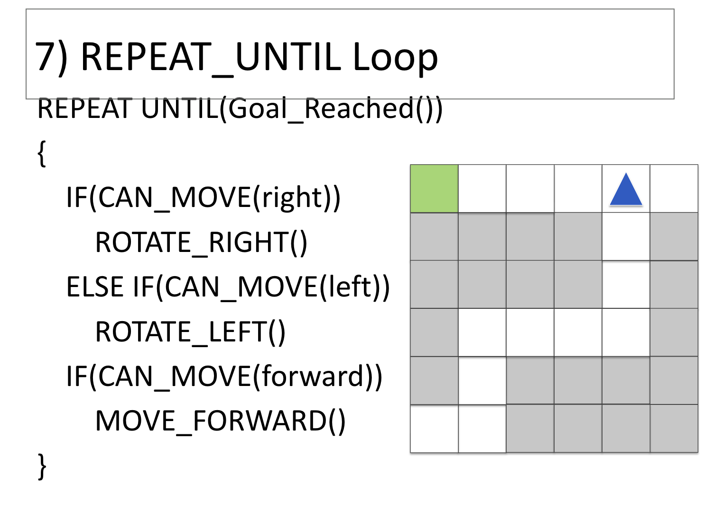

# Maze Navigation Assignment — Right → Left → Forward Algorithm

In this task, you will explore how a robot can navigate through a maze using a simple strategy.

---

## Task Description
- The maze is represented as a **2D grid**, where:
  - `0 = path`
  - `1 = wall`
- The robot starts at `(0,0)` (top-left corner) and must reach `(5,5)` (bottom-right corner).
- The robot always follows this algorithm:
  1. **Check right**: If open, rotate right and move forward.
  2. **Else check left**: If open, rotate left and move forward.
  3. **Else check forward**: If open, move forward.
  4. If no moves are possible, the robot is stuck.

---

## Example Mazes
```python
maze = [
    [0, 0, 0, 0, 0, 0],
    [1, 1, 1, 1, 1, 0],
    [1, 1, 1, 1, 1, 0],
    [1, 1, 1, 1, 1, 0],
    [1, 1, 1, 1, 1, 0],
    [1, 1, 1, 1, 1, 0],
]

maze2 = [
    [0, 0, 1, 1, 1, 0],
    [1, 0, 1, 1, 1, 0],
    [1, 0, 1, 1, 1, 0],
    [1, 0, 1, 1, 1, 0],
    [1, 0, 1, 1, 1, 0],
    [0, 0, 0, 0, 0, 0],
]
```

---

## Python Implementation
```python

maze = [
    [0, 0, 0, 0, 0, 0],
    [1, 1, 1, 1, 1, 0],
    [1, 1, 1, 1, 1, 0],
    [1, 1, 1, 1, 1, 0],
    [1, 1, 1, 1, 1, 0],
    [1, 1, 1, 1, 1, 0],
]

maze2 = [
    [0, 0, 1, 1, 1, 0],
    [1, 0, 1, 1, 1, 0],
    [1, 0, 1, 1, 1, 0],
    [1, 0, 1, 1, 1, 0],
    [1, 0, 1, 1, 1, 0],
    [0, 0, 0, 0, 0, 0],
]

start = (0, 0)
end = (5, 5)

# Directions: 0=N, 1=E, 2=S, 3=W
dirs = [(-1,0), (0,1), (1,0), (0,-1)]
dir_names = ["N", "E", "S", "W"]

def show_position(pos, direction):
    print(f"Robot at {pos}, facing {dir_names[direction]}")

def can_move(maze, pos, direction):
    r, c = pos
    dr, dc = dirs[direction]
    nr, nc = r + dr, c + dc
    if 0 <= nr < len(maze) and 0 <= nc < len(maze[0]):
        return maze[nr][nc] == 0
    return False

def move_forward(pos, direction):
    r, c = pos
    dr, dc = dirs[direction]
    return r + dr, c + dc

# --------------------------
# Algorithm: Right → Left → Forward
# --------------------------
pos = start
direction = 1  # start facing East
show_position(pos, direction)

while pos != end:
    right_dir = (direction + 1) % 4
    left_dir = (direction - 1) % 4

    if can_move(maze, pos, right_dir):   # 1) Right first
        direction = right_dir
        pos = move_forward(pos, direction)
        show_position(pos, direction)

    elif can_move(maze, pos, left_dir):  # 2) Else left
        direction = left_dir
        pos = move_forward(pos, direction)
        show_position(pos, direction)

    elif can_move(maze, pos, direction): # 3) Else forward
        pos = move_forward(pos, direction)
        show_position(pos, direction)

    else:                                # 4) No moves possible
        print("Stuck! No moves possible.")
        break

if pos == end:
    print("Goal reached!")
else:
    print("Failed to reach goal.")
```

---

# Programming Assignment — Lists, Loops, and Searching

## Task Overview
In this assignment, you will practice working with **lists**, **loops**, and **conditional statements** in Python.  
You will implement two main tasks:

1. **Find minimum, maximum, and average** from a list of numbers.  
2. **Implement Linear Search** to find a target number in the list.

---

## Step 1: Input a List of Numbers
- Ask the user to input **10 integers** separated by spaces.  
- Convert the input into a list of integers.  

**Hint:**  
```python
numbers = list(map(int, input("Enter 10 numbers: ").split()))
```

---

## Step 2: Find Minimum, Maximum, and Average
- Start `min_val` and `max_val` as the first element of the list.  
- Loop through the list:  
  - If a number is smaller than `min_val`, update `min_val`.  
  - If a number is larger than `max_val`, update `max_val`.  
- Use a loop to calculate the sum of all numbers.  
- Divide by the length of the list to find the average.  

**Hint:**  
```python
min_val = numbers[0]
max_val = numbers[0]
total = 0

for n in numbers:
    if n < min_val:
        min_val = n
    if n > max_val:
        max_val = n
    total += n

average = total / len(numbers)
```

---

## Step 3: Implement Linear Search
- Ask the user for a **target number**.  
- Use a `for` loop to go through the list by index.  
- If the current element matches the target, store the index and stop searching.  
- If the loop finishes without finding the number, return -1.  

**Hint:**  
```python
target = int(input("Enter a number to search: "))
found = -1

for i in range(len(numbers)):
    if numbers[i] == target:
        found = i
        break
```

---

## Step 4: Print the Results
- Print **minimum, maximum, and average** values.  
- Print the **search result**:  
  - If found, display the index.  
  - If not found, display a message that the number was not found.  

---

## Example Run
```
Enter 10 numbers: 5 9 2 7 3 8 1 6 4 10
Minimum: 1
Maximum: 10
Average: 5.5
Enter a number to search: 7
7 found at index 3
```

---

